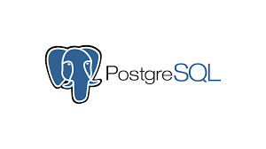
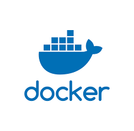
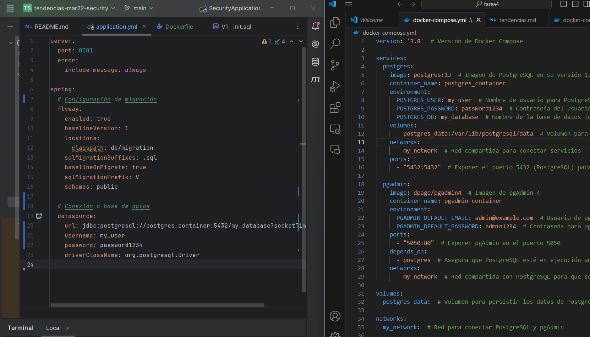
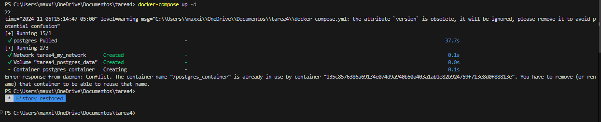
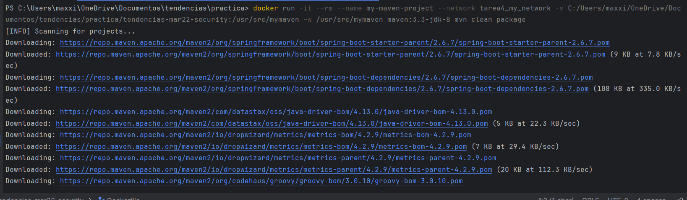
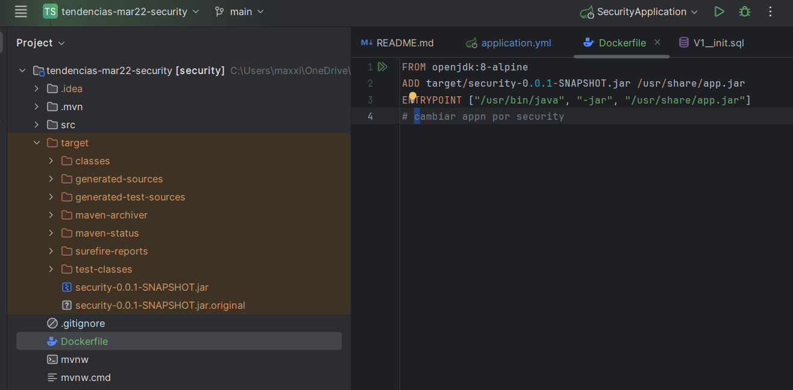
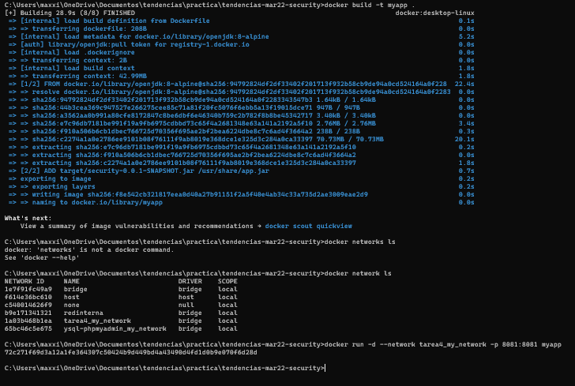
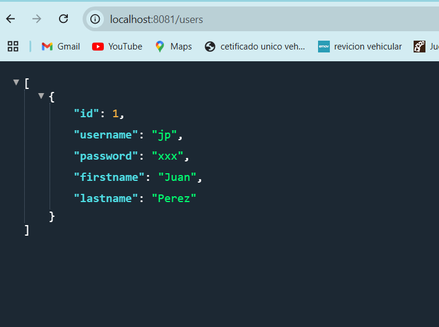

# PRÁCTICA DE CONTENEDORES POSTGRESQL

## 1. Título
Generación de un archivo JAR usando contenedores de Maven y PostgreSQL

## 2. Tiempo de duración
Para esta práctica se realizo en una duración de 2 horas aproximadamente 

## 3. Fundamentos:

PostgreSQL: es un sistema de gestión de bases de datos relacional de código abierto, conocido por su robustez, escalabilidad y cumplimiento de estándares SQL.

Figura 1: Logo de PostgreSQL

Docker: es una plataforma que permite la creación y ejecución de aplicaciones en contenedores. Un contenedor es una instancia ligera y portátil que incluye todo lo necesario para que una aplicación funcione, como el código, las librerías y las configuraciones.

Figura 2: Logo de Docker

Maven: Es una herramienta de gestión y construcción de proyectos Java. Con Maven, es posible compilar el código y generar el archivo JAR para la aplicación. En esta práctica, utilizaremos un contenedor Docker de Maven para realizar esta operación en un entorno aislado.

## 4. Conocimientos previos
Para esta práctica es importante el conocimiento de los siguientes temas:

- Comandos básicos de Linux: Interacción con la terminal, navegación y uso de permisos
- Conceptos básicos de Docker: Imágenes, contenedores y volúmenes
- Conocimientos de SQL y bases de datos relacionales para interactuar con PostgreSQL

## 5. Objetivos a alcanzar

- Crear contenedores para PostgreSQL y Maven.
- Configurar el contenedor PostgreSQL con persistencia de datos usando volúmenes de Docker.
- Generar el archivo JAR del proyecto usando un contenedor Maven.
- Establecer y probar la conexión entre el contenedor Maven y PostgreSQL a través de una red Docker.

## 6. Equipo necesario

- Computador con sistema operativo Windows/Linux/Mac
- Cuenta en Docker Play (correo institucional)
- Navegador web actualizado

## 7. Material de apoyo

- Documentación oficial de Docker
- Documentación oficial de PostgreSQL
- Guía y materiales adicionales de la asignatura

## 8. Procedimiento

Paso 1: Se debe clonar el repositorio para poder obtener el proyecto, en el cual vamos a editar lo que es el aplication.yml, esto dependiendo de los datos que pusimos en el docker-compose.yml que realizamos anteriormente dandole un usuario y una contraseña con el cual se podra ingresar al pgadmin

Figura 4: Archivo compose.

Paso 2: Abrimos la terminal en la ubicación del archivo docker-compose.yml y ejecutamos el siguiente comando para iniciar los contenedores, pero tiene que estar abierta la aplicacion de docker desktop.

Figura 5: Docker.

Paso 3: Tenemos que colocar el comando 'docker run -it --rm --name my-maven-project --network db_default -v /home/optica/deploy/optica/opticabe:/usr/src/mymaven -w /usr/src/mymaven maven:3.3-jdk-8 mvn clean package' el cual tenemos que modificar con el nombre de nuestra red y la direccion de en donde se encuentra nuestro proyecto y nos tiene que salir al final Build Success para verificar que esta correctamente instalado y podremos observar que se ha creado una carpeta llamada target.

Figura 6: Red

Paso 4:  Tenemos que crear una carpeta dentro del directorio que se va a llamar Dockerfile en donde tenemos que agregar el siguiente codigo y tenemos que colocar el nombre que esta en el archivo de la carpeta test-classes

Figura 7: Red

Paso 5:  Por ultimo tenemos que abrir en el directorio del archivo un cmd donde iran los siguientes comandos 'docker build -t myapp .'donde my app sera el nombre de la imagen, una vez creada la imagen se coloca otro comando 'docker run -d --network tarea4_my_network -p 8081:8081 myapp' que es el contenedor 

Figura 8: Red

## 9. Resultados esperados:
    
Al finalizar la práctica, se pudo generar un archivo jar con el contenedor maven y una red docker que permite la comunicacion con el contenedor maven y postgres.

Figura 9: Red

## 10. Bibliografía

- Docker: Accelerated Container Application Development. (2024). Docker. https://www.docker.com/
- PostgreSQL: The World's Most Advanced Open Source Relational Database. (2024). PostgreSQL. https://www.postgresql.org/

